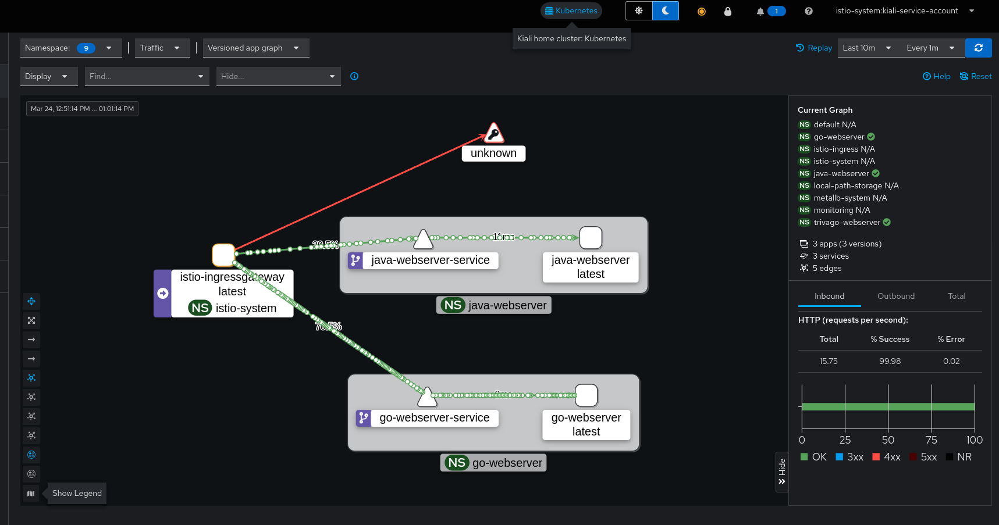
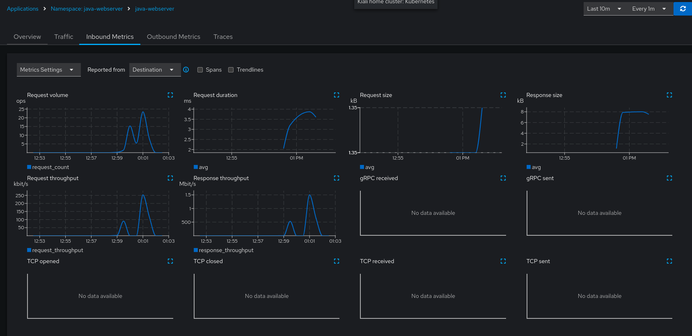

# Prerequisites
To install the dependencies to install just, run `make`. If you don't have make, run `sudo apt install make`.

Now with `Just` installed on your system, all the tools you will need to have installed on your local machine are provided in the `justfile` with the `deps` command

# To setup all the local tools, kubernetes stack and monitoring at once
Run `just setup-all-infra`

# To setup the apps with all the configurations
Run `just setup-all-apps`

# Just documentation
```
$ just
Available recipes:
    default                     # Helper/List all the available commands and their description
    deps                        # Install all the tools you will need to setup the project
    generate-load-to-specific-service # Load test the individual applications Go and Java
    generate-load-traffic-split # Generate load test to common endpoint trivago.example.com with backend Go and Java to test traffic split
    go-build                    # Build the Go app
    go-push                     # Docker tag and push the Go app to the local registry
    helm-install-go             # Install the Go app using Helm
    helm-install-java           # Install the Java app using Helm
    java-build                  # Build the Java app
    java-push                   # Docker tag and push the Java app to the local registry
    open-dashboards             # Open all dashs like kiali (token will be printed on terminal), jaeger, prometheus and grafana
    set-context                 # Set the current kubernetes context to the kind cluster
    setup-all-apps              # Spinup all the applications configurations from build, push to helm install
    setup-all-infra             # Spinup all the infrastructure from local k8s to monitoring
    setup-delete-all            # Cleanup the installation
    setup-ingress-gateway       # Install the istio ingress gateway
    setup-istio                 # Install istio CRDs and istiod -- control plane
    setup-kiali                 # Configure Kiali, Prometheus, Grafana, Tracing (Jaeger)
    setup-kind                  # Create local kubernetes cluster with KinD
    setup-metallb               # Configure metallb to have an loadbalancer on the cluster and expose services to the host machine
    setup-traffic-split         # Configure traffic split between Go and Java apps
    test-apps                   # Simple curl to test the apps are up and running
```

# Result
After running the apps and starting the `generate-load-traffic-split` this is the expected result to be seen on Kiali




# Additional notes
I usually install every dev tool with `asdf`, it makes my environment pretty easy to replicate and I don't need to think too much on how to install a new tool, if an asdf plugin is not available for the tool I'm installing then I will follow the tool documentation on how to install it. This allow me to easily switch between different version of the tools too.

I had trouble with K3d and could not get it working quickly, I was starting to spend to much time troubleshooting here so I decided to use another tool I already knew: [kind](https://github.com/kubernetes-sigs/kind). Later I realized the problems were related with the old machine I was running the setup and their lack of cgroups v2.

I could have installed istio with `istioctl` binary but to keep the standard of deploying everything with Helm I configured: `just setup-istio`.

For a production system I believe all the commands could be improved to be more idempotent so I could check if some tool was already installed or not before trying to install, I could install a specific version instead of just relying on latests, check for errors and perform retry if the installation failed for some reason at some point, all that would be nice for a more mature setup.

There are opportunity for improvements on the build/push part because I'm always building the same version v0.0.1. For a production system this could be tagged based on the branch or based on SemVer+Conventional Commits, so a commit with fix: would change only the minor version, if the base version on the registry was v0.0.1, then it would be tagged now as v0.0.2, for a feat: it would change to v0.1.0, for a commit starting with major/BREAKING CHANGE: this would lead to v1.0.0.

Everything was tested on Debian 12 (my main host) and Ubuntu 22.04 LTS (on a Virtual Machine inside gnome-boxes) before my submission to double-check the solution. I don't have a Mac to try it.